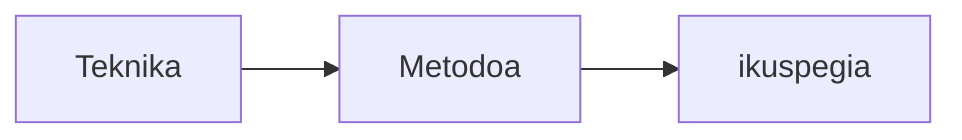
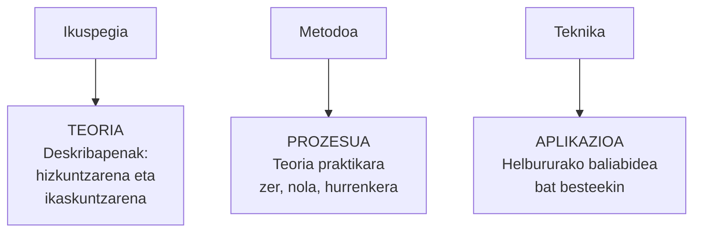
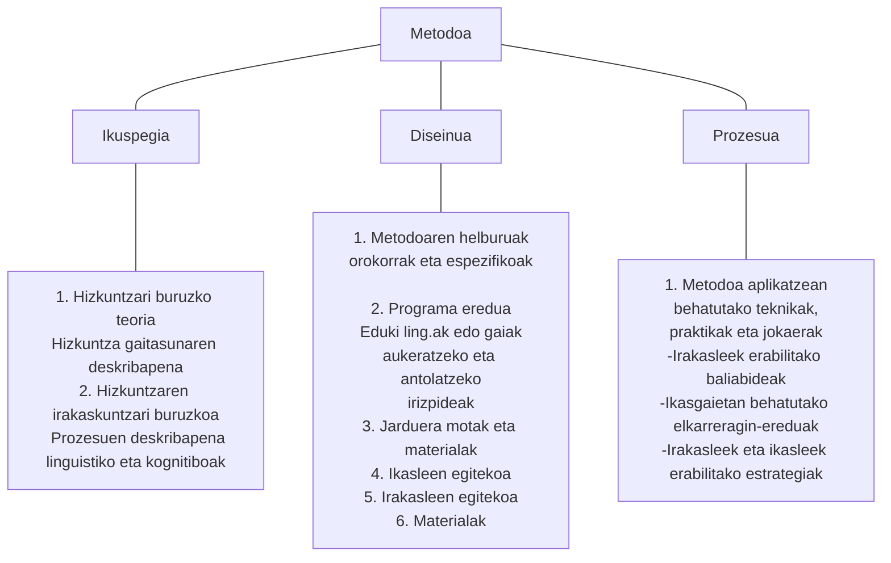
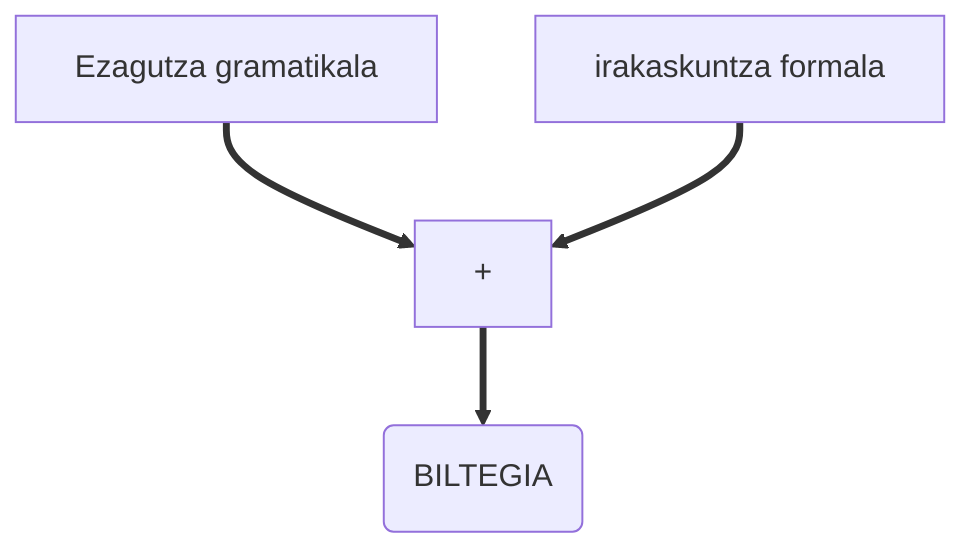
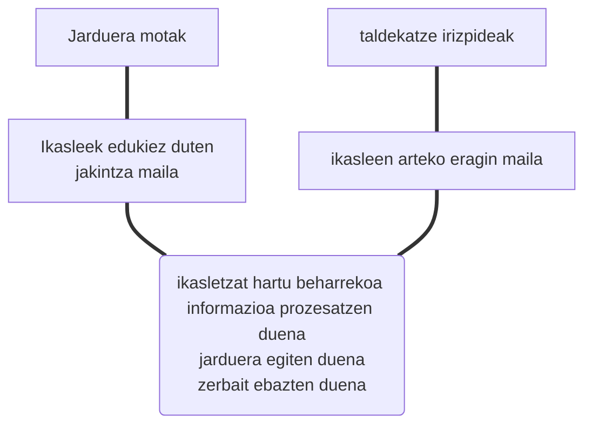
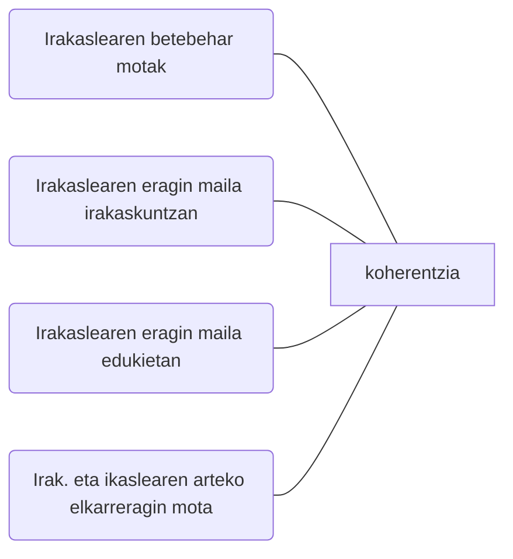
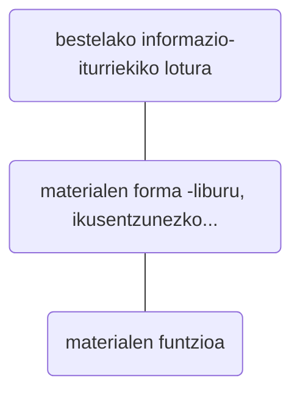

#  Hizkuntzen irakaskuntzarako metodoak

 Zenbait galdera hasieran erantzuteko:

1. Badago alderik, zure ustez, *ikuspegia*, *metodoa* eta *teknika* kontzeptuen artean?
2. Zerk osatzen du hizkuntzen irakaskuntzarako metodoa?
3. Zein metodo daude hizkuntzen ikaskuntza eta irakaskuntzarako?
4. Zein ezaugarri dituzte?

Galderon lehenengo erantzun bat eman behar zenuke(te), argiago ulertzeko segidan datorren teoria-eta. Horretan aurreko galderei erantzun oinarritu bat ematen saiatu nahi da.

(Edward Anthony, 1963)

(Richards, C eta Rodgers, S, 2009)

## Hizkuntzari buruzko teoriak

### Estrukturalismoa ('50)

Behaviorismoa eta linguistika estrukturalean oinarritzen da. Hizkuntza arau jakinak dituen ohitura sistema da. Beraz, irakaskuntzan:

* Garrantzia du jatorrizko hiztunek elakrrizketan erabiltzen dituzten **esaldiak imitatu eta buruz ikasteak**.
* Hizkuntza ikastea **ohitura linguistikoak** ikastea da. Behin eta berriro **errepikatu** behar dira egiturok.
* Ahalegin handia egiten da ikasleak **ez dezan okerrik egin**.
* **Egiturak progresiboki ordenatzen** dira eta banan banan irakasten.
* Garrantzi berezia ematen zaio ahoskerari.
* **Gramatika deduktiboki azaltzen da** adibideen bitartez.
* **Entzun-ikusgailuak** erabiltzen dira: zintak, hizkuntza laborategiak eta metodo bisualak

### Nozional-funtzionala ('70)

Hizkuntzaren dimentsio semantiko-komunikatiboari begiratzen zaio. Hizkuntza tresnatzat hartzen da, funtzio joakin bat lortzeko erabiltzen dena.  Beraz, irakasuntzan:

* Edukiak antolatnze dira adieraren eta tuntzioaren arabera (National Syllabuses, Wilkins, 1976)
* Gramatikaren irakaskuntzari ez zaio garrantzi handirik ematen.
* Hizketarako egiturak irakatsi behar dira.
* Nozioen (hitzen esangura, denbora...) eta funtzioen (agurtzea, aurkeztea...) arteko loturari garrantzia.
* Irakaskuntza programek honakoak zehaztu behar ditu ikaslea komunikatzeko:
  * Gramatika
  * Lexikoa
  * Gaiak
  * Nozioak
  * Kontzeptuak

### Interaktiboa ('80)

Hizkuntza ulertzen da elkarreragin moduan, norberaren garapenerako eta elkarreragin sozioalerako. Beraz, honela ulertu behar da irakasuntza:

+ Elkarreraginean agertzen diren egiturak aztertu eta irakatsi:
  + Negoziazioa
  + Ekintza

> Los estudiantes logran la facilidad en el usa de una lengua cuando su atención se centra en transmitir y recibir mensajes auténticos. 
> *Rivers1987*

**Adibideak**: Hizkuntza jardueren bidez ikastea, programazio neurolinguistikoa, hizkuntzaren ikaskuntza kooperatiboa, Edukietan oinarritutako irakaskuntza.

### Galdera nagusi bi erantzuteko:

> Zer prozesu kognitibok eta psikolinguistikok hartzen du parte hizkuntzaren ikaskuntzan?

> Zein baldintza dira nahitaezkoak ikaskuntza-prozesu horiek aurrera eramateko?

1.  KRASHEN-en Monitorearen Eredua (1981) eredu naturala
   Jabekuntza eta ikaskuntza bereizten ditu.

Stephen Krashen (1987) psikolinguistak hizkuntza‐informazioa prozesatzeko –eta ondorioz hizkuntza gaitasuna lortzeko ere‐ bi prozesu bereizi zituen: jabekuntza (acquisition) eta ikaskuntza (learning), hurrenez hurren.

#### Hizkuntzen jabekuntza

| Ezaugarriak                                                  | Prozesua                                                     | Emaitza                                                      |
| ------------------------------------------------------------ | ------------------------------------------------------------ | ------------------------------------------------------------ |
| Praktikoa Erabilerari lotua (elkarreragina). Ez-kontzientea. Okerrez jabetzen garen arren, ez dakigu zergatia (gramatika arauak) | Egoera komunikatiboan input ulergarria jaso ondoren berez sortzen den hizkuntza-gaitasuna | Era automatikoan sortzen eta ateratzen diren hitzak eta esaldiak |

#### Hizkuntzen ikaskuntza

| Ezaugarriak                                                  |      |      |
| ------------------------------------------------------------ | :--: | ---- |
| Indukzio eta dedukzio prozesu logikoen emaitza. Arau, definiziko, printzipio eta informazio-unitateen ezagutza esplizitua Arreta kontzientea Arrazoiaren eremua Metahizkuntza: hizkuntzari buruzko ezagutza teorikoa. Itzulpen-mekanismoa: H1ean esaldiak sortu eta hizkuntza ezagutza formala erabilz H2ko esaldi bihurtu. Monitorearen teoria. |      |      |

**Eta praktikan zer?**

Praktikan maiz ikusten ditugu bata eta bestea hiztun baten jardueran. Ez dira nahastu behar:

* Berezko ezagutza eskuratzea **jabekuntza** prozesuaren ardura da.
* Arrazoiaren bitarteko ezagutza **ikaskuntzari** dagokio.

#### Nola jabetzen da bigarren hizkuntzaz pertsona bat?

Krashenek (1987) dioenez hizkuntzaz jabetzen gara **I+1 ulertzean**.

Ekuazio horretako elementuak hauek dira:

I
 : Hizkuntza inputa

\+1
 : Ulertzen dena baino maila bat gehiago

Hizkuntza-inputaren bitartez hizkuntzaren jabe izateko beharrezkoa da:

* Inputa ulergarria izatea.

* Arreta edo interesa piztu behar du.
* Hizkuntza osotasunean agertu behar da, ez arau gramatikalak soilik.
* Xede-hizkuntza hitz egiten den eremuan murgilduta.

#### Haurrak nola jabetzen dira hizkuntzaz

Itzair Laka (2005)

Jaio orduko: Amaren hizkuntzaren doinu batzuk bereizten ditu.

Jaio bezain laster: Soinuak izan daitezkeen fonema guztiak bereizteko gaitasuna du. Gero hori galdu egiten da. Lehen 4-5 hilabeteetan. 

Adibideak
 : Japoniarrek eta txinatarrek *R* eta *L*. Denok berdin erabiltzen duzue gaztelaniazko *J*? Entzun.
 : Euskara ikasten duten helduek ergatiboaren *K*.

Hizkuntza jakinen fonologia bereganatu ahala, soinuak bereizteari uzten zaio.

6 hilabetetik aurrera: Egiturez jabetzen hasten dira. Helduen hitz jarioan silabak non diren sumatzen dute. Frekuentziak ateratzen dituzte. Fonologiaz eta silabez jabetzean “ma”, “pa”... silabak egiten dituzte. Mundu osoko ume guztiak silaba berberak egiten dituzte hasieran: ezpainkaria (b, m, p)+bokala.

Ondoren... espezialiazazioa: hizkuntzari dagozkion soinu bereziak egiten dituzte.

3 urterekin: Hizkuntza ikasi du: atal guztien jabekuntza ez da aldi berean egiten (ikertzen ari dira).

## Metodoaren diseinua 

### IKASlearen zeregina

### IRAKASlearen zeregina

### Baliabide materialak

## Hizkuntzaren ikaskuntza kooperatiboa

> “El aprendizaje cooperativo es una actividad de aprendizaje en grupo organizada de manera que el aprendizaje esté en dependencia del intercambio de información, socialmente estructurado, entre los alumnos distribuidos en grupos, y en el cual a cada alumno se le considera responsable de su propio aprendizaje y se le motiva para aumentar el aprendizaje de los demás.”
>
> (Olsen y Kagan, 1992: 8)

Hizkuntzen ikaskuntza komunikatiboaren ildokoa da ikaskuntza kooperatiboa. Hona zergatik:

* Hizkuntza era naturalean lantzen da taldean eta bakarka egiten diren jardueren bidez.
* Elkarreraginaren bidez hizkuntzaren sistema lantzen da: lexikoa, hizkuntza-egiturak eta funtzio komunikatiboak.
* Komunikazio- eta ikas-estrategiak lantzen dira.

---

# Jarduera(txu)

**Zein ikaskuntza teoria**tan oinarritu dugu gure planteamendu praktikoa; hurrengo jarreretan zuena identifikatu eta horren arabera + hemengo baliabidetxu hau erabilita **sarrera idatzi zuen Sekuentzia Didaktiko / Unitate Didaktikoari**.

> Hitz egiteko jaio gara

ala

> Gehien erabiltzen dugun testu mota, elkarrizketa da

ala

> Elkarrizketak kooperazio irizpideen arabera antolatu ditugu

Vygotskyk eta Piagetek nabarmendu zuten 1965ean: ***Gizartearekiko elkarreraginaren bidez ikasten dugu***.

Aztertu ezaugarriok:

- [ ] Interdependentzia positiboa
- [ ] Taldea eratzea
- [ ] Bakoitzaren ardura
- [ ] Gizarteko trebetasunak
- [ ] Egituratzea

Orain bai: zuen lana aztertu eta sarrera polita idatzi egiozue.

